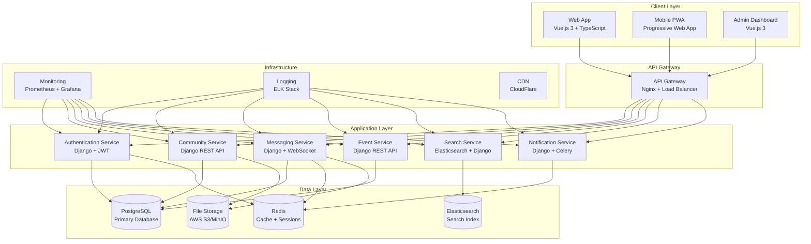
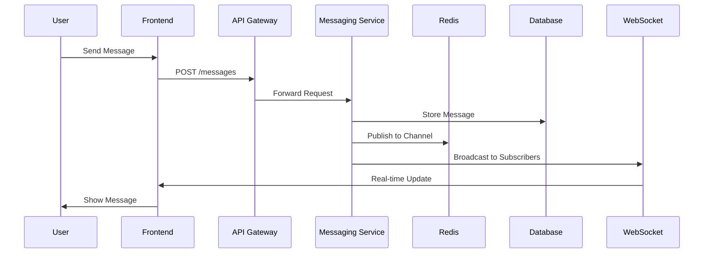
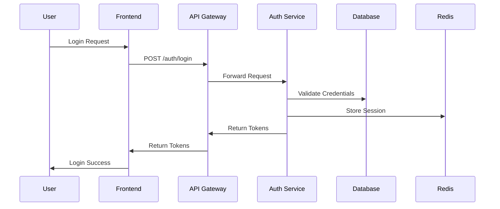

# Architecture Overview

This document provides a comprehensive overview of the Naboom NeighborNet Community Communication Hub architecture, including system design, components, data flow, and technical decisions.

## System Overview

Naboom NeighborNet is a modern, scalable community communication platform built with a microservices architecture. The system is designed to handle real-time communication, event management, and security coordination for South African communities.

## High-Level Architecture



## Frontend Architecture

### Technology Stack

- **Framework**: Vue.js 3 with Composition API
- **Language**: TypeScript for type safety
- **Styling**: Tailwind CSS 4 with DaisyUI 5
- **State Management**: Pinia for reactive state
- **Routing**: Vue Router with locale-aware routing
- **Internationalization**: Vue I18n with English and Afrikaans support
- **Build Tool**: Vite 7+ for fast development and building
- **Testing**: Vitest for unit testing, Playwright for E2E testing

### Component Architecture

```
src/
├── components/           # Reusable UI components
│   ├── common/          # Common components (buttons, forms, etc.)
│   ├── hub/            # Community hub components
│   ├── profile/        # User profile components
│   └── auth/           # Authentication components
├── pages/              # Page components
├── layouts/            # Layout components
├── composables/        # Composition functions
├── stores/             # Pinia stores
├── services/           # API services
├── types/              # TypeScript type definitions
├── utils/              # Utility functions
└── locales/            # Translation files
```

### State Management

The application uses Pinia for state management with the following stores:

- **AuthStore**: User authentication and session management
- **CommunityStore**: Community data and membership
- **MessageStore**: Real-time messaging state
- **EventStore**: Event management and RSVPs
- **ProfileStore**: User profile and settings
- **ThemeStore**: UI theme and preferences
- **I18nStore**: Language and localization settings

### Real-time Communication

Real-time features are implemented using:

- **WebSocket**: For real-time messaging and presence
- **Server-Sent Events**: For notifications and updates
- **IndexedDB**: For offline message queuing
- **Service Workers**: For background sync and push notifications

## Backend Architecture

### Technology Stack

- **Framework**: Django 4.2+ with Django REST Framework
- **Language**: Python 3.11+
- **Database**: PostgreSQL 15+ for primary data
- **Cache**: Redis 7+ for caching and sessions
- **Search**: Elasticsearch 8+ for full-text search
- **Message Queue**: Celery with Redis broker
- **WebSocket**: Django Channels with Redis channel layer
- **File Storage**: AWS S3 or MinIO for file storage

### Service Architecture

#### Authentication Service

Handles user authentication, authorization, and session management:

- **JWT Tokens**: Access and refresh token management
- **OAuth2**: Social login integration
- **Rate Limiting**: API rate limiting and abuse prevention
- **Security**: Password hashing, account verification, 2FA support

#### Community Service

Manages community data, membership, and permissions:

- **Community CRUD**: Create, read, update, delete communities
- **Membership Management**: Join, leave, approve members
- **Role-Based Access**: Admin, moderator, member roles
- **Channel Management**: Public and private channels

#### Messaging Service

Handles real-time messaging and communication:

- **WebSocket**: Real-time message delivery
- **Message Storage**: Persistent message storage
- **File Attachments**: File upload and sharing
- **Message Search**: Full-text search capabilities
- **Typing Indicators**: Real-time typing status
- **Presence**: User online/offline status

#### Event Service

Manages community events and RSVPs:

- **Event CRUD**: Create, update, delete events
- **RSVP Management**: Attendee management
- **Notifications**: Event reminders and updates
- **Calendar Integration**: iCal export support

#### Search Service

Provides search functionality across the platform:

- **Elasticsearch**: Full-text search engine
- **Message Search**: Search within messages
- **User Search**: Find community members
- **Event Search**: Search events and activities
- **Faceted Search**: Filter by categories, dates, etc.

#### Notification Service

Handles push notifications and alerts:

- **Email Notifications**: SMTP integration
- **Push Notifications**: Web push API
- **SMS Notifications**: Twilio integration
- **In-App Notifications**: Real-time notifications

### Database Design

#### Core Entities

```sql
-- Users table
CREATE TABLE users (
    id UUID PRIMARY KEY,
    email VARCHAR(255) UNIQUE NOT NULL,
    password_hash VARCHAR(255) NOT NULL,
    first_name VARCHAR(100) NOT NULL,
    last_name VARCHAR(100) NOT NULL,
    display_name VARCHAR(100),
    bio TEXT,
    avatar_url VARCHAR(500),
    phone_number VARCHAR(20),
    is_verified BOOLEAN DEFAULT FALSE,
    is_active BOOLEAN DEFAULT TRUE,
    created_at TIMESTAMP DEFAULT NOW(),
    updated_at TIMESTAMP DEFAULT NOW()
);

-- Communities table
CREATE TABLE communities (
    id UUID PRIMARY KEY,
    name VARCHAR(200) NOT NULL,
    description TEXT,
    category VARCHAR(50) NOT NULL,
    is_public BOOLEAN DEFAULT TRUE,
    created_by UUID REFERENCES users(id),
    created_at TIMESTAMP DEFAULT NOW(),
    updated_at TIMESTAMP DEFAULT NOW()
);

-- Community memberships
CREATE TABLE community_memberships (
    id UUID PRIMARY KEY,
    community_id UUID REFERENCES communities(id),
    user_id UUID REFERENCES users(id),
    role VARCHAR(20) DEFAULT 'member',
    status VARCHAR(20) DEFAULT 'pending',
    joined_at TIMESTAMP DEFAULT NOW(),
    UNIQUE(community_id, user_id)
);

-- Channels table
CREATE TABLE channels (
    id UUID PRIMARY KEY,
    community_id UUID REFERENCES communities(id),
    name VARCHAR(100) NOT NULL,
    display_name VARCHAR(100) NOT NULL,
    description TEXT,
    is_private BOOLEAN DEFAULT FALSE,
    created_at TIMESTAMP DEFAULT NOW()
);

-- Messages table
CREATE TABLE messages (
    id UUID PRIMARY KEY,
    channel_id UUID REFERENCES channels(id),
    author_id UUID REFERENCES users(id),
    content TEXT NOT NULL,
    message_type VARCHAR(20) DEFAULT 'text',
    parent_id UUID REFERENCES messages(id),
    created_at TIMESTAMP DEFAULT NOW(),
    updated_at TIMESTAMP DEFAULT NOW()
);

-- Events table
CREATE TABLE events (
    id UUID PRIMARY KEY,
    community_id UUID REFERENCES communities(id),
    organizer_id UUID REFERENCES users(id),
    title VARCHAR(200) NOT NULL,
    description TEXT,
    event_date DATE NOT NULL,
    event_time TIME NOT NULL,
    location VARCHAR(200),
    category VARCHAR(50),
    max_attendees INTEGER,
    is_public BOOLEAN DEFAULT TRUE,
    created_at TIMESTAMP DEFAULT NOW(),
    updated_at TIMESTAMP DEFAULT NOW()
);
```

#### Indexes and Performance

```sql
-- Performance indexes
CREATE INDEX idx_messages_channel_created ON messages(channel_id, created_at DESC);
CREATE INDEX idx_messages_author ON messages(author_id);
CREATE INDEX idx_events_community_date ON events(community_id, event_date);
CREATE INDEX idx_community_memberships_user ON community_memberships(user_id);
CREATE INDEX idx_community_memberships_community ON community_memberships(community_id);

-- Full-text search indexes
CREATE INDEX idx_messages_content_search ON messages USING gin(to_tsvector('english', content));
CREATE INDEX idx_events_title_search ON events USING gin(to_tsvector('english', title));
```

## Security Architecture

### Authentication & Authorization

- **JWT Tokens**: Stateless authentication with short-lived access tokens
- **Refresh Tokens**: Long-lived tokens for obtaining new access tokens
- **Role-Based Access Control**: Granular permissions based on user roles
- **API Rate Limiting**: Prevents abuse and DoS attacks
- **CORS Configuration**: Secure cross-origin resource sharing

### Data Protection

- **Encryption at Rest**: Database encryption using PostgreSQL TDE
- **Encryption in Transit**: TLS 1.3 for all communications
- **Password Security**: bcrypt hashing with salt
- **Input Validation**: Comprehensive input sanitization and validation
- **SQL Injection Prevention**: Parameterized queries and ORM usage

### Security Headers

```http
Content-Security-Policy: default-src 'self'; script-src 'self' 'unsafe-inline'; style-src 'self' 'unsafe-inline'
X-Frame-Options: DENY
X-Content-Type-Options: nosniff
X-XSS-Protection: 1; mode=block
Strict-Transport-Security: max-age=31536000; includeSubDomains
Referrer-Policy: strict-origin-when-cross-origin
```

### Vulnerability Management

- **Dependency Scanning**: Automated vulnerability scanning
- **Security Testing**: Comprehensive security test suite
- **Penetration Testing**: Regular third-party security assessments
- **Security Monitoring**: Real-time security event monitoring

## Performance Architecture

### Caching Strategy

- **Redis Cache**: Application-level caching for frequently accessed data
- **CDN**: Static asset delivery via CloudFlare
- **Browser Caching**: Aggressive caching for static resources
- **Database Query Optimization**: Optimized queries with proper indexing

### Scalability Design

- **Horizontal Scaling**: Stateless services for easy scaling
- **Load Balancing**: Nginx load balancer with health checks
- **Database Sharding**: Future-ready for database sharding
- **Microservices**: Independent service scaling
- **Async Processing**: Celery for background tasks

### Performance Monitoring

- **Application Metrics**: Custom metrics for business logic
- **Infrastructure Metrics**: Server and database performance
- **User Experience**: Real User Monitoring (RUM)
- **Error Tracking**: Comprehensive error logging and alerting

## Deployment Architecture

### Environment Strategy

- **Development**: Local development with Docker Compose
- **Staging**: Production-like environment for testing
- **Production**: High-availability production deployment

### Container Strategy

```dockerfile
# Frontend Dockerfile
FROM node:20-alpine AS builder
WORKDIR /app
COPY package*.json ./
RUN npm ci --only=production
COPY . .
RUN npm run build

FROM nginx:alpine
COPY --from=builder /app/dist /usr/share/nginx/html
COPY nginx.conf /etc/nginx/nginx.conf
EXPOSE 80
```

### Infrastructure as Code

- **Terraform**: Infrastructure provisioning
- **Docker**: Containerization
- **Kubernetes**: Container orchestration (future)
- **CI/CD**: GitHub Actions for automated deployment

### Monitoring & Observability

- **Application Monitoring**: Prometheus + Grafana
- **Log Aggregation**: ELK Stack (Elasticsearch, Logstash, Kibana)
- **Error Tracking**: Sentry integration
- **Uptime Monitoring**: External uptime monitoring
- **Health Checks**: Comprehensive health check endpoints

## Data Flow Architecture

### Real-time Message Flow



### Authentication Flow



## Internationalization Architecture

### Language Support

- **Primary Language**: English (default)
- **Secondary Language**: Afrikaans
- **RTL Support**: Right-to-left text rendering
- **Locale Detection**: Automatic language detection
- **Translation Management**: Easy translation updates

### Implementation

- **Frontend**: Vue I18n for client-side translations
- **Backend**: Django's internationalization framework
- **Database**: Unicode support (UTF-8)
- **API**: Locale-aware API responses

## Testing Architecture

### Testing Strategy

- **Unit Tests**: Component and function testing
- **Integration Tests**: API and service integration
- **End-to-End Tests**: Complete user workflow testing
- **Load Tests**: Performance and scalability testing
- **Security Tests**: Vulnerability and penetration testing

### Test Automation

- **CI/CD Integration**: Automated test execution
- **Test Data Management**: Isolated test environments
- **Coverage Reporting**: Code coverage metrics
- **Performance Testing**: Automated performance regression testing

## Future Architecture Considerations

### Planned Enhancements

- **Microservices Migration**: Gradual migration to microservices
- **Event Sourcing**: Event-driven architecture for audit trails
- **CQRS**: Command Query Responsibility Segregation
- **GraphQL**: Alternative API layer for complex queries
- **Machine Learning**: AI-powered features and recommendations

### Scalability Roadmap

- **Kubernetes**: Container orchestration for better scaling
- **Service Mesh**: Istio for service-to-service communication
- **Multi-Region**: Global deployment for better performance
- **Edge Computing**: Edge deployment for reduced latency

---

This architecture provides a solid foundation for the Naboom NeighborNet Community Communication Hub, ensuring scalability, security, and maintainability while meeting the specific needs of South African communities.
